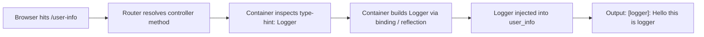
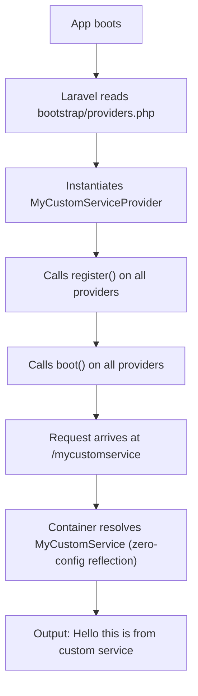
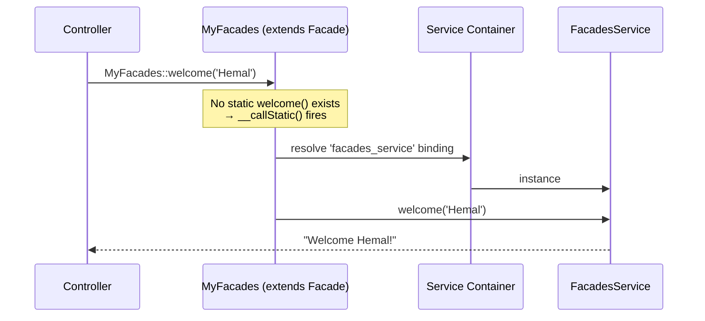
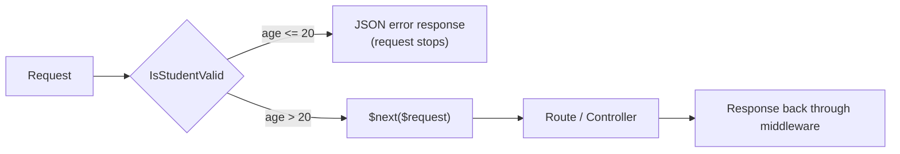
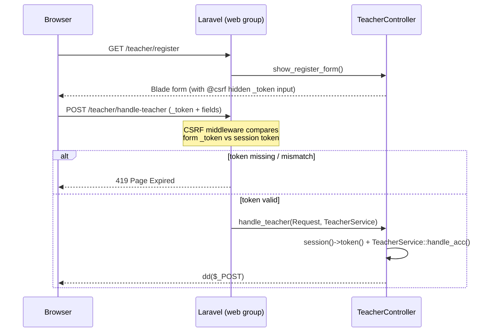
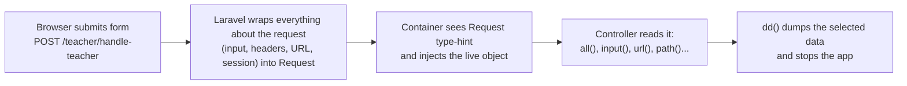
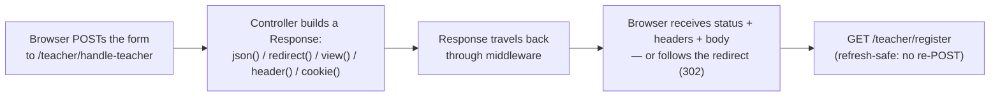
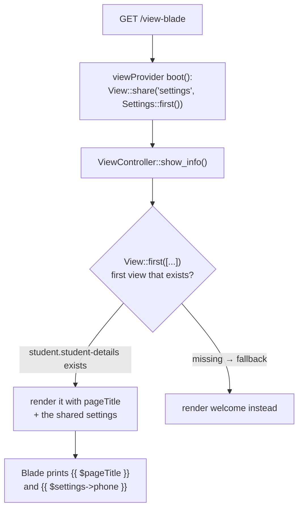
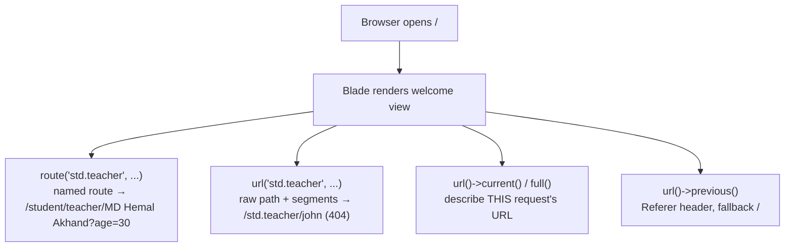
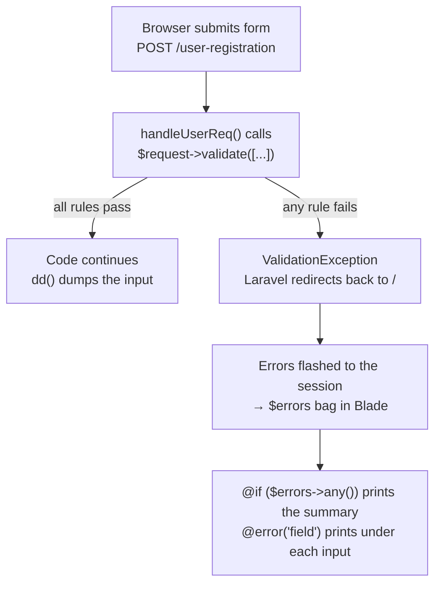

# Learning Laravel — Branch-by-Branch Guide

This repository is a **hands-on Laravel learning journey**. Each branch is one lesson, built step by step on top of the previous one. Switch to any branch and run the app to see that lesson's code in action.

| Branch | Lesson | Key Concepts |
| ------ | ------ | ------------ |
| [`01-Service-Container-Part-01`](https://github.com/mdhemalakanda/Learning-Laravel/tree/01-Service-Container-Part-01) | Service Container (Part 1) | Dependency Injection, `$app->bind()` |
| [`02-Service-Container-Part-02-custom-boot`](https://github.com/mdhemalakanda/Learning-Laravel/tree/02-Service-Container-Part-02-custom-boot) | Service Container (Part 2) | Custom Service Provider, `bootstrap/providers.php` |
| [`03-Facades`](https://github.com/mdhemalakanda/Learning-Laravel/tree/03-Facades) | Facades | `getFacadeAccessor()`, `__callStatic()`, static access to container services |
| [`04-Route`](https://github.com/mdhemalakanda/Learning-Laravel/tree/04-Route) | Routing | Route groups, prefix, name, route parameters, custom route files, resource routes |
| [`05-Middleware`](https://github.com/mdhemalakanda/Learning-Laravel/tree/05-Middleware) | Middleware | Custom middleware, middleware aliases, request filtering |
| [`06-CSRF-Token-Validation`](https://github.com/mdhemalakanda/Learning-Laravel/tree/06-CSRF-Token-Validation) | CSRF Protection | `@csrf` directive, session tokens, POST form handling |
| [`07-Controller`](https://github.com/mdhemalakanda/Learning-Laravel/tree/07-Controller) | Controllers | Invokable (single-action) controllers, resource controllers |
| [`08-Request`](https://github.com/mdhemalakanda/Learning-Laravel/tree/08-Request) | HTTP Requests (Part 1) | Request injection, `all()`, `input()`, `url()`, `path()` |
| [`08-HTTP-Requests`](https://github.com/mdhemalakanda/Learning-Laravel/tree/08-HTTP-Requests) | HTTP Responses (Part 2) | `response()` with headers/cookies, `redirect()`, `view()`, `response()->json()` |
| [`09-View`](https://github.com/mdhemalakanda/Learning-Laravel/tree/09-View) | Views | `view()` data passing (`compact()`, `with()`), `View::first()` fallback, `View::share()` via service provider |
| [`10-URL-Generation`](https://github.com/mdhemalakanda/Learning-Laravel/tree/10-URL-Generation) | URL Generation | `url()` helper, `url()->current()` / `full()` / `previous()`, `url()` vs `route()` |
| [`11-Validation`](https://github.com/mdhemalakanda/Learning-Laravel/tree/11-Validation) | Validation | `$request->validate()`, validation rules, `$errors` bag, `@error` directive |

---

## Table of Contents

- [Branch 01 — Service Container (Part 1)](#branch-01--service-container-part-1)
- [Branch 02 — Service Container (Part 2): Custom Service Provider](#branch-02--service-container-part-2-custom-service-provider)
- [Branch 03 — Facades](#branch-03--facades)
- [Branch 04 — Routing](#branch-04--routing)
- [Branch 05 — Middleware](#branch-05--middleware)
- [Branch 06 — CSRF Token Validation](#branch-06--csrf-token-validation)
- [Branch 07 — Controllers](#branch-07--controllers)
- [Branch 08 — HTTP Requests](#branch-08--http-requests)
- [Branch 08 (Part 2) — HTTP Responses](#branch-08-part-2--http-responses)
- [Branch 09 — Views](#branch-09--views)
- [Branch 10 — URL Generation](#branch-10--url-generation)
- [Branch 11 — Validation](#branch-11--validation)

---

## Branch 01 — Service Container (Part 1)

> **Topic:** What the Service Container is and how **Dependency Injection** works.
> **New files:** `app/service/Logger.php`, `app/service/Notice.php`, `app/Http/Controllers/userInfo.php`
> **Modified:** `app/Providers/AppServiceProvider.php`, `routes/web.php`
> **Official docs:** [Service Container](https://laravel.com/docs/container) · [Service Providers](https://laravel.com/docs/providers)

### Files in This Lesson

| File | Role |
| ---- | ---- |
| `app/service/Logger.php` | Plain service class — `log()` prefixes a message with `[logger]:` |
| `app/service/Notice.php` | Plain service class — `print()` prefixes a message with `Notice:` |
| `app/Providers/AppServiceProvider.php` | `register()` binds `Notice::class`, teaching the container how to build it |
| `app/Http/Controllers/userInfo.php` | Controller — type-hints `Logger` / `Notice`; the container injects them |
| `routes/web.php` | `/user-info` and `/notice` routes pointing at the controller |

### The Concept

The **Service Container** (also called the IoC container) is a powerful tool for managing **class dependencies** and performing **dependency injection**. Instead of a class creating its own dependencies with `new`, you simply *type-hint* what you need and Laravel's container **automatically builds and injects it** for you.

When a type-hinted dependency is a **concrete class** (not an interface), Laravel can resolve it with **zero configuration** — it uses reflection to inspect the constructor and build the object. If a class needs special construction logic (or you're binding an interface), you teach the container how to build it using `bind()` inside a service provider's `register()` method.

### The Code

**1. Simple service classes** — plain PHP classes with no Laravel magic:

```php
// app/service/Logger.php
namespace App\Service;

class Logger {
    public function log($message) {
        return '[logger]: '. $message;
    }
}
```

```php
// app/service/Notice.php
namespace App\Service;

class Notice {
    public function print($message) {
        return 'Notice: '. $message;
    }
}
```

**2. Register a binding in the service provider** — this teaches the container *how* to build `Notice` when it is ever requested:

```php
// app/Providers/AppServiceProvider.php
public function register(): void
{
    $this->app->bind(Notice::class, function($app) {
        return new Notice();
    });
}
```

**3. Inject the services into a controller** — just type-hint them in the method signature. The container sees the type-hints and injects ready-to-use objects:

```php
// app/Http/Controllers/userInfo.php
use App\Service\Logger;
use App\Service\Notice;

class userInfo extends Controller
{
    public function user_info(Logger $logger) {
        $log = $logger->log('Hello this is logger');
        echo $log;
    }

    public function get_notice(Notice $notice) {
        echo $notice->print('Hello its notice');
    }
}
```

**4. Wire up routes:**

```php
// routes/web.php
Route::get('/user-info', [UserInfo::class, 'user_info']);
Route::get('/notice', [UserInfo::class, 'get_notice']);
```

### How It Works



### Try It

| URL | Result |
| --- | ------ |
| `/user-info` | `[logger]: Hello this is logger` |
| `/notice` | `Notice: Hello its notice` |

---

## Branch 02 — Service Container (Part 2): Custom Service Provider

> **Topic:** Creating your **own service provider** and registering it with the framework.
> **New files:** `app/Providers/MyCustomServiceProvider.php`, `app/service/MyCustomService.php`, `app/Http/Controllers/MyCustomServiceController.php`
> **Modified:** `bootstrap/providers.php`, `routes/web.php`
> **Official docs:** [Service Providers](https://laravel.com/docs/providers) · [Service Container](https://laravel.com/docs/container)

### Files in This Lesson

| File | Role |
| ---- | ---- |
| `app/service/MyCustomService.php` | The service — `greet()` returns the hello string |
| `app/Providers/MyCustomServiceProvider.php` | Your own provider — where the container binding is intended (see the heads-up below) |
| `app/Http/Controllers/MyCustomServiceController.php` | Injects `MyCustomService` and echoes `greet()` |
| `bootstrap/providers.php` | Registers the provider so Laravel loads it on every request |
| `routes/web.php` | The `/mycustomservice` route |

### The Concept

Service providers are the **central place to bootstrap all of Laravel's services** — your own as well as Laravel's core ones. Every provider extends `Illuminate\Support\ServiceProvider` and has two important methods:

| Method | Purpose |
| ------ | ------- |
| `register()` | **Only bind things into the service container.** Runs first, for *all* providers. |
| `boot()` | Runs **after all providers are registered** — safe to use any framework service here. |

New providers are generated with Artisan and must be **registered** in `bootstrap/providers.php` so Laravel knows to load them:

```bash
php artisan make:provider MyCustomServiceProvider
```

### The Code

**1. The custom service:**

```php
// app/service/MyCustomService.php
namespace App\Service;

class MyCustomService {
    public function greet() {
        return 'Hello this is from custom service';
    }
}
```

**2. The custom service provider** — intended to bind the service so the container knows about it:

```php
// app/Providers/MyCustomServiceProvider.php
namespace App\Providers;

use Illuminate\Support\ServiceProvider;
use App\Service\MyCustomService;

class MyCustomServiceProvider extends ServiceProvider
{
    public function register(): void
    {
        $this->app->boot(MyCustomService::class, function($app) {
            return new MyCustomService();
        });
    }

    public function boot(): void
    {
        //
    }
}
```

> **⚠️ Heads-up:** The canonical container-binding method is `$this->app->bind(...)`, not `boot()`. `Application::boot()` takes no arguments, so the extra arguments here are silently ignored — the binding is never actually registered. The injection in the controller still works because Laravel resolves **concrete classes with zero configuration** (pure reflection), no binding required. Compare with Branch 01, which uses `bind()` correctly.

**3. Register the provider** so Laravel loads it on every request:

```php
// bootstrap/providers.php
return [
    App\Providers\AppServiceProvider::class,
    App\Providers\MyCustomServiceProvider::class,
];
```

**4. Inject it into a controller** — again, just a type-hint:

```php
// app/Http/Controllers/MyCustomServiceController.php
use App\Service\MyCustomService;

class MyCustomServiceController extends Controller
{
    public function show_service(MyCustomService $service) {
        echo $service->greet();
    }
}
```

**5. The route:**

```php
Route::get('/mycustomservice', [MyCustomServiceController::class, 'show_service']);
```

### How It Works



### Try It

| URL | Result |
| --- | ------ |
| `/mycustomservice` | `Hello this is from custom service` |

---

## Branch 03 — Facades

> **Topic:** What facades are, how they work under the hood, and how to create a **custom facade**.
> **New files:** `app/Facades/MyFacades.php`, `app/service/FacadesService.php`, `app/Providers/FacadesServiceProvider.php`
> **Modified:** `app/Http/Controllers/MyCustomServiceController.php`, `bootstrap/providers.php`
> **Official docs:** [Facades](https://laravel.com/docs/facades)

### Files in This Lesson

| File | Role |
| ---- | ---- |
| `app/service/FacadesService.php` | The real worker — static `welcome()` builds the greeting |
| `app/Providers/FacadesServiceProvider.php` | Binds the service into the container under the key `facades_service` (see the heads-up below) |
| `app/Facades/MyFacades.php` | The custom facade — `getFacadeAccessor()` returns `facades_service`; `__callStatic()` forwards the static call to the container-resolved instance |
| `app/Http/Controllers/MyCustomServiceController.php` | `show_service()` — the entry point that calls the service |
| `bootstrap/providers.php` | Registers `FacadesServiceProvider` |

### The Concept

A **facade** is a class that provides a **static-like interface to services stored in the service container**. Facades serve as *proxies* for accessing underlying classes — they make code shorter and more expressive, without making the code hard to test.

**How facades work (from the official docs):**

1. Laravel's facades (and any custom facade you create) extend the base `Illuminate\Support\Facades\Facade` class.
2. Your facade defines one method: `getFacadeAccessor()`, which returns **the name of a service container binding**.
3. The `Facade` base class uses PHP's `__callStatic()` **magic method** to defer any static call from your facade to an object **resolved from the container**.

So when you write `Cache::get(...)`, no static method `get` actually exists on the facade class — Laravel resolves the `cache` binding from the container and calls `get` on that real object.

### The Code

**1. The underlying service class** (the real worker, with a `static` method):

```php
// app/service/FacadesService.php
namespace App\Service;

class FacadesService {
    public static function welcome($name) {
        return 'Welcome '. $name. '!';
    }
}
```

**2. Bind it into the container under a string key** (the provider is registered in `bootstrap/providers.php`, same as Branch 02):

```php
// app/Providers/FacadesServiceProvider.php
public function register(): void
{
    $this->app->boot('facades_service', function($app) {
        return new FacadesService();
    });
}
```

> **⚠️ Heads-up:** Same note as Branch 02 — use `$this->app->bind('facades_service', fn ($app) => new FacadesService())` to actually register the binding in the container. A facade's `getFacadeAccessor()` must return a key that **really exists as a container binding**, otherwise the facade call fails.

**3. The custom facade** — its only job is to map "static calls" to the `facades_service` binding:

```php
// app/Facades/MyFacades.php
namespace App\Facades;

use Illuminate\Support\Facades\Facade;

class MyFacades extends Facade {
    protected static function getFacadeAccessor() {
        return 'facades_service';
    }
}
```

**4. Usage in the controller:**

```php
// app/Http/Controllers/MyCustomServiceController.php
public function show_service() {
    echo \App\Service\FacadesService::welcome('Hemal');
}
```

> **ℹ️ Note:** This controller calls the service class **directly** (`FacadesService::welcome(...)`). To exercise the actual **facade machinery** added in this branch, call it through the facade instead:
>
> ```php
> use App\Facades\MyFacades;
>
> public function show_service() {
>     echo MyFacades::welcome('Hemal'); // __callStatic() → container → FacadesService::welcome()
> }
> ```

### How a Facade Call Flows



### Try It

| URL | Result |
| --- | ------ |
| `/mycustomservice` | `Welcome Hemal!` |

---

## Branch 04 — Routing

> **Topic:** Route groups, route name prefixes, dynamic route parameters, custom route files, and resource routes.
> **New files:** `routes/admin.php`, `app/Http/Controllers/AdminController.php`, `app/Http/Controllers/IndexController.php`, `app/service/StudentService.php`
> **Modified:** `bootstrap/app.php`, `routes/web.php`, `resources/views/welcome.blade.php`
> **Official docs:** [Routing](https://laravel.com/docs/routing) · [Controllers](https://laravel.com/docs/controllers)

### Files in This Lesson

| File | Role |
| ---- | ---- |
| `routes/admin.php` | The second route file — `student/teacher/{name}` group named `std.teacher` |
| `app/Http/Controllers/IndexController.php` | Target of the hand-written CRUD group and `Route::resource('student', ...)` |
| `app/Http/Controllers/AdminController.php` | Practices service injection — `get_stuents(StudentService $student)` echoes the student list |
| `app/service/StudentService.php` | Returns the placeholder student-list string |
| `bootstrap/app.php` | `withRouting(web: [web.php, admin.php])` — loads both route files |
| `routes/web.php` | Prefix/name groups, `{id}` parameters, resource route |
| `resources/views/welcome.blade.php` | Link hub — generates its link with `route('std.teacher', ...)` |

### The Concept — Route Groups

Route groups let you **share attributes** (prefix, name prefix, middleware) across many routes **without repeating them** on each route. Nested attributes merge intelligently.

- `Route::prefix('x')` — prepends a **URI** prefix to every route in the group.
- `Route::name('x.')` — prepends a **name** prefix (note the trailing dot) to every route name in the group.

### The Code

**1. Grouping with prefix + name prefix:**

```php
// routes/web.php
Route::name('admin.')->prefix('learnhunter')->group(function () {

    Route::get('/dashboard', function () {
        return "Welcome to the admin dashboard";
    })->name('dashboard');   // Full name: admin.dashboard → URL: /learnhunter/dashboard

    Route::get('/settings', function () {
        return "Admin settings page";
    })->name('setting');     // Full name: admin.setting → URL: /learnhunter/settings
});
```

**2. Dynamic route parameters** — capture URI segments in `{braces}`; they are injected into your closure/controller by order:

```php
Route::get('/view-student/{id}', function (string $id) {
    return 'User ID: ' . $id;
});
```

**3. A hand-written CRUD group** (index, create, store, show, edit, update, destroy):

```php
Route::prefix('students')->name('students.')->group(function () {
    Route::get('/', [IndexController::class, 'index'])->name('index');
    Route::get('/create', [IndexController::class, 'create'])->name('create');
    Route::post('/store', [IndexController::class, 'store'])->name('store');
    Route::get('/{id}', [IndexController::class, 'show'])->name('show');
    Route::get('/{id}/edit', [IndexController::class, 'edit'])->name('edit');
    Route::put('/{id}', [IndexController::class, 'update'])->name('update');
    Route::delete('/{id}', [IndexController::class, 'destroy'])->name('destroy');
});
```

**4. The shortcut for exactly that CRUD pattern** — a single line registers all seven resource routes:

```php
Route::resource('student', \App\Http\Controllers\IndexController::class); // for crud operation
```

> **ℹ️ Note:** This group exists purely as **practice** for writing routes manually. For real CRUD, prefer `Route::resource()`. (The scaffolded `IndexController` in this branch is still empty, so these routes are demos of routing, not working pages.)

**5. Registering a second route file** — routes don't have to live in `web.php` only. Add extra files to `withRouting()` in `bootstrap/app.php`:

```php
// bootstrap/app.php
return Application::configure(basePath: dirname(__DIR__))
    ->withRouting(
        web: [
            __DIR__.'/../routes/web.php',
            __DIR__.'/../routes/admin.php',   // 👈 new route file
        ],
        commands: __DIR__.'/../routes/console.php',
        health: '/up',
    )
    // ...
```

And inside the new file — a group that combines prefix, name prefix, and a parameter:

```php
// routes/admin.php
Route::prefix('student')->name('std.')->group(function() {
    Route::get('teacher/{name}', function(string $name) {
        return 'Teacher name: '. $name;
    })->name('teacher');   // Route name: std.teacher → URL: /student/teacher/{name}
});
```

**6. Generating links with `route()`** — prefer named routes over hardcoded URLs. The welcome page becomes a simple link hub:

```blade
{{-- resources/views/welcome.blade.php --}}
<h1><a href="{{ route('std.teacher', ['name' => 'MD Hemal Akhand']) }}">Teacher</a></h1>
```

### Try It

| URL | Result |
| --- | ------ |
| `/admin` | `its work for admin` |
| `/view-student/42` | `User ID: 42` |
| `/learnhunter/dashboard` | `Welcome to the admin dashboard` |
| `/student/teacher/MD Hemal Akhand` | `Teacher name: MD Hemal Akhand` |
| `/` | Welcome page with a link generated by `route('std.teacher', ...)` |

---

## Branch 05 — Middleware

> **Topic:** Writing a **custom middleware** and attaching it to a route via an **alias**.
> **New files:** `app/Http/Middleware/IsStudentValid.php`
> **Modified:** `bootstrap/app.php`, `routes/admin.php`
> **Official docs:** [Middleware](https://laravel.com/docs/middleware)

### Files in This Lesson

| File | Role |
| ---- | ---- |
| `app/Http/Middleware/IsStudentValid.php` | The middleware — rejects `age <= 20` with a JSON error, otherwise calls `$next($request)` |
| `bootstrap/app.php` | Registers the alias `student_middleware` → `IsStudentValid::class` |
| `routes/admin.php` | Attaches `->middleware('student_middleware')` to the teacher route |

### The Concept

Middleware provide a convenient mechanism to **inspect and filter HTTP requests** entering your application. Each request passes through middleware layers **before** reaching your route/controller, and the response passes back through them.

A middleware's `handle()` method receives the `$request` and a `$next` **closure** ("the onion"). Calling `$next($request)` passes the request *deeper* into the app. Returning anything else **stops the request** right there.



### The Code

**1. The custom middleware** — reject any request whose `age` is not greater than 20:

```php
// app/Http/Middleware/IsStudentValid.php
namespace App\Http\Middleware;

use Closure;
use Illuminate\Http\Request;
use Symfony\Component\HttpFoundation\Response;

class IsStudentValid
{
    /**
     * Handle an incoming request.
     *
     * @param  Closure(Request): (Response)  $next
     */
    public function handle(Request $request, Closure $next): Response
    {
        if( $request->age <=20 ) {
            return response()->json([
                'error' => 'You must be age grater than 20'
            ]);
        }

        return $next($request);
    }
}
```

**2. Register a short alias** in `bootstrap/app.php` — aliases save you from writing long class names on every route:

```php
// bootstrap/app.php
use App\Http\Middleware\IsStudentValid;

->withMiddleware(function (Middleware $middleware): void {
    $middleware->alias([
        'student_middleware' => IsStudentValid::class
    ]);
})
```

**3. Attach it to a route** using the alias:

```php
// routes/admin.php
Route::prefix('student')->name('std.')->group(function() {
    Route::get('teacher/{name}', function(string $name) {
        return 'Teacher name: '. $name;
    })->name('teacher')->middleware('student_middleware'); // 👈 applied here
});
```

### Try It

| URL | Result |
| --- | ------ |
| `/student/teacher/Rahim?age=25` | `Teacher name: Rahim` (middleware passed) |
| `/student/teacher/Rahim?age=18` | `{"error":"You must be age grater than 20"}` (middleware blocked) |

---

## Branch 06 — CSRF Token Validation

> **Topic:** How Laravel protects POST forms from **Cross-Site Request Forgery (CSRF)**, plus a full provider → service → controller → form flow.
> **New files:** `app/Http/Controllers/TeacherController.php`, `app/Providers/TeacherServiceProvider.php`, `app/service/TeacherService.php`, `resources/views/teacher-registration.blade.php`
> **Modified:** `routes/admin.php`, `bootstrap/providers.php`
> **Official docs:** [CSRF Protection](https://laravel.com/docs/csrf) · [Blade `@csrf`](https://laravel.com/docs/blade#csrf-field)

### Files in This Lesson

| File | Role |
| ---- | ---- |
| `resources/views/teacher-registration.blade.php` | The Blade form — `method="POST"` plus the `@csrf` hidden token field |
| `app/Http/Controllers/TeacherController.php` | `show_register_form()` renders the form; `handle_teacher()` handles the POST |
| `app/service/TeacherService.php` | `handle_acc()` dumps the submitted data (`dd($_POST)`) |
| `app/Providers/TeacherServiceProvider.php` | Provides `TeacherService` into the container |
| `routes/admin.php` | GET `register` + POST `handle-teacher` (named `teacher.create-teacher-acc`) |
| `bootstrap/providers.php` | Registers `TeacherServiceProvider` |

### The Concept

**Cross-Site Request Forgery** is an attack where a malicious website tricks a logged-in user's browser into sending unauthorized requests to *your* app (e.g., transferring money, changing an email) — because browsers automatically attach session cookies, your app can't tell the request apart from a legitimate one.

Laravel's `web` middleware group protects every POST/PUT/PATCH/DELETE request using a **CSRF token**: Laravel generates a random token for each **user session** and stores it in the session. Any incoming form POST must include that same token; if it doesn't match, the request is rejected with a `419 Page Expired` status. A malicious third-party site can't know the token, so it can't forge valid requests.

You can access the current token via `$request->session()->token()` or the `csrf_token()` helper — and Blade's `@csrf` directive generates the hidden form field for you:

```blade
<form method="POST" action="/profile">
    @csrf
    <!-- Equivalent to: <input type="hidden" name="_token" value="{{ csrf_token() }}" /> -->
    ...
</form>
```

### The Code

**1. A Blade registration form** — note the two essentials: `method="POST"` and the `@csrf` directive (without it, this form would get a `419` error):

```blade
{{-- resources/views/teacher-registration.blade.php --}}
<form action={{ route('teacher.create-teacher-acc') }} method="POST">
    @csrf
    <input placeholder="username" name="username" />
    <input placeholder="password" name="password" />
    <input type="submit" name="register_teacher" value="Register" />
</form>
```

**2. Controller** — shows the form on GET, handles the POST. `$request->session()->token()` reads the session's CSRF token (the same value `@csrf` put into the form):

```php
// app/Http/Controllers/TeacherController.php
namespace App\Http\Controllers;

use App\Service\TeacherService;
use Illuminate\Http\Request;

class TeacherController extends Controller
{
    public function show_register_form() {
        return view('teacher-registration');
    }

    public function handle_teacher(Request $request, TeacherService $teacher) {
        $token = $request->session()->token();
        $is_registered = $teacher->handle_acc();
    }
}
```

**3. The service** (built Branch-02 style: provider + container):

```php
// app/service/TeacherService.php
namespace App\Service;

class TeacherService {
    public function handle_acc() {
        dd($_POST);   // dump the submitted form data
    }
}
```

```php
// app/Providers/TeacherServiceProvider.php
public function register(): void
{
    $this->app->boot(TeacherService::class, function($app) {
        return new TeacherService();
    });
}
```

**4. GET + POST route pair** — the POST route is named so the form can point at it with `route()`:

```php
// routes/admin.php
Route::prefix('teacher')->name('teacher.')->group(function() {
    Route::get('register', [TeacherController::class, 'show_register_form']);
    Route::post('/handle-teacher', [TeacherController::class, 'handle_teacher'])->name('create-teacher-acc');
});
```

### How the POST Flow Works



### Try It

1. Visit `/teacher/register` and view the page source — you'll see the hidden `_token` input generated by `@csrf`.
2. Submit the form → Laravel validates the token → `handle_teacher()` runs and dumps the posted data.
3. Bonus test: remove `@csrf` from the form and submit again → `419 Page Expired`.

---

## Branch 07 — Controllers

> **Topic:** **Invokable (single-action) controllers** and **resource controllers**.
> **New files:** `app/Http/Controllers/InvokeController.php`, `app/Http/Controllers/ResourceController.php`
> **Modified:** `routes/web.php`
> **Official docs:** [Controllers](https://laravel.com/docs/controllers)

### Files in This Lesson

| File | Role |
| ---- | ---- |
| `app/Http/Controllers/InvokeController.php` | Invokable (single-action) controller — one `__invoke()` method, routed by class name only |
| `app/Http/Controllers/ResourceController.php` | Resource controller — all 7 CRUD action methods |
| `routes/web.php` | `/invoke` (class only, no `[Class, method]` array) + `Route::resource('resource', ...)` |

### The Concept

Controllers group related request-handling logic into one class. Two special flavors:

**Invokable (single-action) controllers** — if a controller handles exactly *one* action, give it a single `__invoke()` method. Laravel then executes the controller itself like a *function* when routed to it — no method name needed on the route.

**Resource controllers** — when a controller follows the classic CRUD pattern, `Route::resource()` registers **all 7 RESTful routes** with one line, mapping each HTTP verb + URI to a conventional method name.

### The Code

**1. The invokable controller** — notice the `__invoke` method:

```php
// app/Http/Controllers/InvokeController.php
namespace App\Http\Controllers;

use Illuminate\Http\Request;

class InvokeController extends Controller
{
    /**
     * Handle the incoming request.
     */
    public function __invoke(Request $request)
    {
        echo 'something from invoke';
    }
}
```

And its route — **just the class, no `[Class::class, 'method']` array**:

```php
Route::get('/invoke', InvokeController::class);
```

**2. The resource controller** — scaffolded with `php artisan make:controller ResourceController --resource`. Every method maps to one REST action:

```php
// app/Http/Controllers/ResourceController.php
namespace App\Http\Controllers;

use Illuminate\Http\Request;

class ResourceController extends Controller
{
    public function index()                 // GET /resource        — list all
    {
        echo 'this is resource';
    }

    public function create()                // GET /resource/create — show create form
    {
        //
    }

    public function store(Request $request) // POST /resource       — save new
    {
        //
    }

    public function show(string $id)        // GET /resource/{id}   — show one
    {
        //
    }

    public function edit(string $id)        // GET /resource/{id}/edit — edit form
    {
        //
    }

    public function update(Request $request, string $id) // PUT/PATCH /resource/{id}
    {
        //
    }

    public function destroy(string $id)     // DELETE /resource/{id}
    {
        //
    }
}
```

And the single route line that registers all seven actions:

```php
Route::resource('resource', ResourceController::class);
```

### Actions Handled by `Route::resource()` (official docs)

| Verb | URI | Action | Route Name |
| ---- | --- | ------ | ---------- |
| GET | `/resource` | index | resource.index |
| GET | `/resource/create` | create | resource.create |
| POST | `/resource` | store | resource.store |
| GET | `/resource/{id}` | show | resource.show |
| GET | `/resource/{id}/edit` | edit | resource.edit |
| PUT/PATCH | `/resource/{id}` | update | resource.update |
| DELETE | `/resource/{id}` | destroy | resource.destroy |

### Try It

| URL | Result |
| --- | ------ |
| `/invoke` | `something from invoke` |
| `/resource` | `this is resource` |
| `php artisan route:list` | See all 7 auto-generated `resource.*` routes |

---

## Branch 08 — HTTP Requests

> **Topic:** The `Illuminate\Http\Request` object — how Laravel represents an incoming request and the accessors for reading its data.
> **Modified:** `app/Http/Controllers/TeacherController.php`
> **Official docs:** [HTTP Requests](https://laravel.com/docs/requests)

### Files in This Lesson

| File | Role |
| ---- | ---- |
| `app/Http/Controllers/TeacherController.php` | `handle_teacher()` — Request accessors (`all()`, `input()`, `url()`, `path()`) behind uncommented `dd()` lines |
| `resources/views/teacher-registration.blade.php` | The Branch 06 form you submit to feed the Request |

### The Concept

Every HTTP request that enters your Laravel app is wrapped into an `Illuminate\Http\Request` object that holds **everything** about the request: input data (form fields, JSON, query strings), headers, cookies, files, the URL, and the session.

You never construct this object yourself — thanks to the **service container** (Branch 01/02), you simply **type-hint `Request` in your controller method** and Laravel injects the real incoming request automatically:

```php
public function handle_teacher(Request $request, TeacherService $teacher)
```

Once injected, accessor methods let you read exactly what you need:

| Method | Returns |
| ------ | ------- |
| `$request->all()` | **All** input data as an array (form fields + query string) |
| `$request->input('username')` | A **single** input value by name (searches form body and query string) |
| `$request->path()` | The request URI **without** domain or query string — e.g. `teacher/handle-teacher` |
| `$request->url()` | The full URL **without** the query string — e.g. `http://herd_example.test/teacher/handle-teacher` |
| `$request->fullUrl()` | The full URL **including** the query string |
| `$request->session()->token()` | The session's CSRF token (see Branch 06) |

### The Code

The Branch 06 `handle_teacher()` action becomes a playground for these accessors — uncomment any `dd(...)` line to dump that piece of request data instead:

```php
// app/Http/Controllers/TeacherController.php
public function handle_teacher(Request $request, TeacherService $teacher)
{
    // $token = $request->session()->token();
    // $is_registered = $teacher->handle_acc();
    // dd($request->all());
    // dd($request->input('username'));
    // dd($request->url());
    // dd($request->fullUrl());
    dd($request->path());
}
```

### How It Works



### Try It

1. Visit `/teacher/register`, fill in the form, and submit.
2. The active line `dd($request->path())` prints `teacher/handle-teacher`.
3. Swap in the other lines:
   - `dd($request->all())` → `["username" => "...", "password" => "...", "register_teacher" => "Register", "_token" => "..."]`
   - `dd($request->input('username'))` → just the username you typed
   - `dd($request->url())` vs `dd($request->fullUrl())` → add `?x=1` to the form action to see the difference

---

## Branch 08 (Part 2) — HTTP Responses

> **Topic:** The other half of the HTTP cycle — everything a controller can **return**: responses with headers and cookies, redirects, views, and JSON.
> **Modified:** `app/Http/Controllers/TeacherController.php` (the `handle_teacher()` action)
> **Official docs:** [HTTP Responses](https://laravel.com/docs/responses) · [Redirects](https://laravel.com/docs/redirects)

### Files in This Lesson

| File | Role |
| ---- | ---- |
| `app/Http/Controllers/TeacherController.php` | `handle_teacher()` — the response playground: headers, cookies, redirects, `view()`, `json()` behind one-line-at-a-time returns |
| `resources/views/teacher-registration.blade.php` | The Branch 06 form you submit to trigger each response type |

### The Concept

Part 1 (branch `08-Request`) was about **reading** the incoming request. This branch covers what comes back: the **response**. Instead of returning a bare string, a controller returns a **response object** — Laravel's `response()` helper and friends build one for every common need:

| Return | What it produces |
| ------ | ---------------- |
| `response('Hello World!', 200)->header('Content-Type', 'text/plain')` | Body + status + a **custom header** |
| `response('Hello World!', 200)->cookie('name', 'value', 60)` | Body + a **cookie** (60 minutes) |
| `redirect()->back()` | Redirect to the **previous** URL |
| `redirect()->route('teacher.register')` | Redirect to a **named route** |
| `redirect('https://...')` | Redirect to an **external** URL |
| `view('welcome', [...])` | Render a **Blade view** |
| `response()->json([...])` | **JSON** response with the correct `Content-Type: application/json` header |

A typical POST handler follows the **PRG pattern** — *Post/Redirect/Get*: catch the data, save it, then **redirect** so a browser refresh doesn't re-submit the form.

### The Code

Everything happens inside `handle_teacher()` — the Branch 06 handler turned into a **response playground**. Uncomment one `return` at a time and resubmit the form at `/teacher/register`:

```php
// app/Http/Controllers/TeacherController.php
public function handle_teacher(Request $request, TeacherService $teacher)
{
    // pass header.
    // return response('Hello World!', 200)->header('Content-Type', 'text/plain');
    // pass cookie.
    // return response('Hello World!', 200)->cookie('test_cookie', 'Test Cookie', 60);

    // working process.
    // 1. catch the data.
    // 2. insert into database.
    // 3. redirect.
    // return redirect()->back();
    // return redirect()->route('teacher.register');
    // return redirect('https://www.google.com');
    // return view('welcome', ['name', 'hemal']);
    return response()->json([
        'message' => 'json message',
        'data' => $request->all(),
    ]);
}
```

What each `return` produces:

- `response('Hello World!', 200)->header('Content-Type', 'text/plain')` — a body with status `200` and a **custom header**
- `response('Hello World!', 200)->cookie('test_cookie', 'Test Cookie', 60)` — same body plus a **cookie** that lives 60 minutes
- `redirect()->back()` — 302 to the **previous** URL
- `redirect()->route('teacher.register')` — 302 via a **named route** (see the note at the bottom)
- `redirect('https://www.google.com')` — 302 to an **external** URL
- `view('welcome', ...)` — renders a **Blade** view
- `response()->json([...])` — the **active** line: a JSON body with the correct `Content-Type: application/json` header, echoing everything `$request->all()` caught from the form

> **⚠️ Heads-up:** The `view()` experiment above passes a plain list — `['name', 'hemal']` — where the docs use key/value data: `view('welcome', ['name' => 'hemal'])`. A plain list becomes the variable `$0`, `$1` in Blade instead of `$name`. Compare with Branch 04's working examples.

### How It Works



### Try It

1. Submit the form at `/teacher/register`.
2. The active `return response()->json(...)` gives:
   `{"message":"json message","data":{"username":"...","password":"...","register_teacher":"Register","_token":"..."}}`
3. Swap in the other returns and observe the difference:
   - `redirect()->back()` → browser lands back on the form (classic PRG flow)
   - `redirect()->route('teacher.register')` → same, but by route **name** — survives future URL changes
   - `->cookie('test_cookie', ...)` → DevTools → Application → Cookies → `test_cookie`
   - `->header('Content-Type', 'text/plain')` → DevTools → Network → Response Headers
   - `view('welcome', ...)` → the welcome Blade page instead of a redirect

> **ℹ️ Note:** `redirect()->route('teacher.register')` targets the **GET** `register` route (named in `routes/admin.php`), not the POST-only `teacher.create-teacher-acc`. Following a redirect issues a **GET** — and a GET to a POST-only route throws `405 MethodNotAllowedHttpException`.

---

## Branch 09 — Views

> **Topic:** Returning Blade views from controllers — three ways to pass data, the `View::first()` fallback chain, and sharing a variable with **all** views via `View::share()` in a service provider.
> **New files:** `app/Http/Controllers/ViewController.php`, `app/Providers/viewProvider.php`, `app/Models/Settings.php`, `resources/views/view-blade.blade.php`, `resources/views/student/student-details.blade.php`
> **Modified:** `routes/web.php`, `bootstrap/providers.php`, `database/seeders/DatabaseSeeder.php` (+ new migration, factory, and `SettingsSeeder`)
> **Official docs:** [Views](https://laravel.com/docs/views) · [Blade Templates](https://laravel.com/docs/blade)

### Files in This Lesson

| File | Role |
| ---- | ---- |
| `app/Http/Controllers/ViewController.php` | `show_info()` — three data-passing styles + `View::first()` fallback |
| `app/Providers/viewProvider.php` | `boot()` — `View::share('settings', Settings::first())` makes `$settings` global to every view |
| `app/Models/Settings.php` | Eloquent model for the `settings` table |
| `database/migrations/2026_09_12_082644_create_settings_table.php` | Creates the `settings` table (with the `phone` column) |
| `database/factories/SettingsFactory.php` | Generates fake `phone` values |
| `database/seeders/SettingsSeeder.php` | Inserts the one settings row the provider reads |
| `resources/views/student/student-details.blade.php` | First view in the `View::first()` array — the one actually rendered |
| `resources/views/view-blade.blade.php` | The fallback candidate — prints `$pageTitle` + shared `$settings->phone` |
| `routes/web.php` | The `/view-blade` route (named `view-blade`) |
| `bootstrap/providers.php` | Registers `viewProvider` |

### The Concept

Controllers rarely return raw strings — they **render views**. Laravel resolves a view by its dot-notation name: `student.student-details` maps to `resources/views/student/student-details.blade.php`.

**Passing data to a view** — three equivalent styles, each making the key available as a variable in Blade (`{{ $pageTitle }}`):

| Style | Example |
| ----- | ------- |
| Key/value array (most used) | `view('view-blade', ['pageTitle' => $pageTitle])` |
| `compact()` | `view('view-blade', compact('pageTitle'))` |
| Chained `with()` | `view('view-blade')->with('pageTitle', $pageTitle)` |

**`View::first()`** — renders the **first view in the array that actually exists**. Useful when views can be customized or overridden: `View::first(['student.student-details', 'welcome'], $data)` falls back to `welcome` if the student view is missing.

**`View::share()`** — makes a variable available to **every** view in the app. The docs recommend calling it from a service provider's `boot()` method (see Branch 02) — the classic use case is site-wide data like app settings. This branch shares a `Settings` model backed by a new `settings` table (migration + factory + seeder).

### The Code

**1. The controller** — three ways to pass `$pageTitle`, with the active line using `View::first()`:

```php
// app/Http/Controllers/ViewController.php
public function show_info() {
    $pageTitle = 'View Page';
    // return view('view-blade', compact('pageTitle')); // most used
    // return view('view-blade')->with('pageTitle', $pageTitle);
    return View::first(['student.student-details', 'welcome'], ['pageTitle' => $pageTitle]);
}
```

`View::first()` checks the array left to right: `student.student-details` exists, so that is the view rendered. Delete it, and the fallback `welcome` wins instead.

**2. The route:**

```php
// routes/web.php
Route::get('/view-blade', [ViewController::class, 'show_info'])->name('view-blade');
```

**3. Sharing `$settings` with every view** — in the provider's `boot()` (registered in `bootstrap/providers.php`):

```php
// app/Providers/viewProvider.php
use App\Models\Settings;
use Illuminate\Support\Facades\View;

public function boot(): void
{
    // Artisan commands (like `migrate`) also boot providers —
    // skip the DB query there so the settings table can be created first.
    if (app()->runningInConsole()) {
        return;
    }

    $settings = Settings::first();
    View::share('settings', $settings);

    // show {{ $settings->phone }} in any blade view
}
```

After this, `{{ $settings->phone }}` works in **any** Blade file — both views in this branch print it.

**4. The views:**

```blade
{{-- resources/views/student/student-details.blade.php --}}
student details

<p>Phone (shared by View::share): {{ $settings->phone }}</p>
```

```blade
{{-- resources/views/view-blade.blade.php --}}
{{ $pageTitle }}

<p>Phone (shared by View::share): {{ $settings->phone }}</p>
```

**5. The backing data** — a new `Settings` model with a `phone` column, plus a `SettingsSeeder` (called from `DatabaseSeeder`) so the table has a row:

```bash
php artisan migrate --seed
```

> **⚠️ Heads-up:** Providers boot on **every** request *and* every artisan command, so a DB query in `boot()` runs always. The `runningInConsole()` guard stops `php artisan migrate` from querying the `settings` table **before it exists** — without it, migration dies with `no such table: settings` (the command crashes while booting, before it can create the table).

> **⚠️ Heads-up:** The `use App\Models\Settings;` import is mandatory. Without it, PHP resolves `Settings` to `App\Providers\Settings`, which doesn't exist — and since providers boot on every request, **every** route in the app fatal-errors, not just `/view-blade`.

### How It Works



### Try It

| URL | Result |
| --- | ------ |
| `/view-blade` | `student details` + `Phone (shared by View::share): +880 1700-000000` |
| Temporarily rename `resources/views/student/student-details.blade.php`, revisit | The fallback `welcome` view renders instead — `View::first()` picked the next existing view |
| Swap the commented lines in `show_info()` | `compact()` and `with()` render the exact same page |

---

## Branch 10 — URL Generation

> **Topic:** Generating URLs with the `url()` helper, inspecting the incoming request's URL with the `url()->...` accessors, and the difference between `url()` and `route()`.
> **Modified:** `resources/views/welcome.blade.php`
> **Official docs:** [URLs](https://laravel.com/docs/urls)

### Files in This Lesson

| File | Role |
| ---- | ---- |
| `resources/views/welcome.blade.php` | Playground view — builds a link with `url()`, prints the current / full / previous URL accessors |
| `routes/admin.php` | Defines the `std.teacher` route the links point at (from Branch 04) |

### The Concept

Laravel's URL generator builds links in two fundamentally different ways:

| Helper | Builds from | Example output |
| ------ | ----------- | -------------- |
| `url('path')` | A raw **path** | `url('admin/settings')` → `http://app.test/admin/settings` |
| `route('name', [...])` | A **named route** | `route('std.teacher', ['name' => 'john'])` → `http://app.test/student/teacher/john` |

The same `url()` function also doubles as an inspector for the **incoming request's** URL:

| Accessor | Returns |
| -------- | ------- |
| `url()->current()` | The current URL **without** the query string |
| `url()->full()` | The current URL **including** the query string |
| `url()->previous()` | The URL the visitor came from (the `Referer` header), falling back to `/` |

### The Code

```blade
{{-- resources/views/welcome.blade.php --}}
<h1><a href="{{ route('std.teacher', ['name' => 'MD Hemal Akhand', 'age' => 30]) }}">Teacher</a></h1>
<a href="{{ urL('std.teacher', ['name' => 'john']) }}">Teacher</a><br/><br/>
Current URL: {{ url()->current() }}<br/><br/>
Current Full URL: {{ url()->full() }}<br/><br/>
previous URL: {{ url()->previous() }}<br/><br/>
```

(PHP helper names are case-insensitive, so `urL()` behaves exactly like `url()`.)

What each line produces:

- `route('std.teacher', ['name' => ..., 'age' => 30])` — the named route with `name` filling the `{name}` placeholder and the extra `age` becoming a query string: `/student/teacher/MD Hemal Akhand?age=30`
- `url('std.teacher', ['name' => 'john'])` — a **path** URL; array parameters are collapsed into **path segments**: `/std.teacher/john`
- `url()->current()` vs `url()->full()` — identical here; add `?x=1` to the address bar and `full()` keeps it while `current()` drops it
- `url()->previous()` — `/` on a direct visit (no referrer), otherwise the page you came from

> **⚠️ Heads-up:** `url()` does **not** resolve route names. `url('std.teacher', ...)` builds the literal path `/std.teacher/john`, which matches no route — clicking the second link gives a **404**. The `route()` link above it works because named routes are its job. Compare the two links side by side on `/`.

### How It Works



### Try It

| URL | Result |
| --- | ------ |
| `/` (direct visit) | Top link → `/student/teacher/MD Hemal Akhand?age=30`; second link → `/std.teacher/john`; Current = Full URL = `http://<host>/`; previous = `/` |
| Add `?x=1` to `/` and reload | `Current Full URL` now shows the `?x=1`, `Current URL` doesn't |
| Click the **second** Teacher link | `404` — proof that `url()` built a path, not a route URL |
| Click the **top** Teacher link | `Teacher name: MD Hemal Akhand` with `?age=30` in the query string |

---

## Branch 11 — Validation

> **Topic:** Validating incoming request data with `$request->validate()` and showing the error messages in Blade with `@error`.
> **Modified:** `app/Http/Controllers/userInfo.php`, `routes/web.php`, `resources/views/welcome.blade.php`
> **Official docs:** [Validation](https://laravel.com/docs/validation) · [Blade `@error`](https://laravel.com/docs/blade#validation-errors)

### Files in This Lesson

| File | Role |
| ---- | ---- |
| `app/Http/Controllers/userInfo.php` | `handleUserReq()` — runs the validation rules before touching the data |
| `routes/web.php` | POST `/user-registration` route (named `handle-user`) pointing at the controller |
| `resources/views/welcome.blade.php` | The form — `@csrf`, an `@error` block under each field, and an `$errors` summary on top |

### The Concept

**Validation** checks incoming input against **rules** before your app works with it. The quickest way is `$request->validate([...])` inside the controller:

- If **every rule passes**, `validate()` returns the validated data (only the fields you listed) and your code continues normally.
- If **any rule fails**, Laravel throws a `ValidationException`. For standard web requests the framework catches it and **redirects the visitor back** to the form, flashing all messages into the shared `$errors` bag. No `if/else` needed — the redirect happens automatically.

The rules used in this lesson:

| Rule | Fails when... | Example message |
| ---- | ------------- | --------------- |
| `required` | The field is missing or an empty string | `The username field is required.` |
| `string` | The value is not a string | `The username must be a string.` |
| `min:6` / `max:50` | The value is shorter / longer than the limit | `The password field must be at least 6 characters.` |

In Blade, the `@error('field')` directive scopes the messages of a single field — inside it, `$message` holds the first error for that field. `@if ($errors->any())` renders the full list above the form.

### The Code

**1. Validate in the controller** — list the rules per field; if validation fails, the automatic redirect-back happens before `dd()` is ever reached:

```php
// app/Http/Controllers/userInfo.php
public function handleUserReq(Request $request)
{
    $validated = $request->validate([
        'username' => ['required', 'string', 'max:255'],
        'password' => ['required', 'min:6', 'max:50'],
    ]);

    dd($request->all());
}
```

**2. The route** — the form posts to the named route `handle-user`:

```php
// routes/web.php
Route::post('/user-registration', [userInfo::class, 'handleUserReq'])->name('handle-user');
```

**3. The Blade form** — `@csrf` from Branch 06, an `@error` block under each field, and an `$errors` summary on top:

```blade
{{-- resources/views/welcome.blade.php --}}
@if ($errors->any())
    <div class="alert alert-danger">
        <ul>
            @foreach ($errors->all() as $error)
                <li>{{ $error }}</li>
            @endforeach
        </ul>
    </div>
@endif
<form method="POST" action="{{ route('handle-user') }}">
    @csrf
    <input name="username" placeholder="Username" type="text" />
    @error('username')
        <div class="alert alert-danger">{{ $message }}</div>
    @enderror
    <input name="password" placeholder="Password" type="password" />
    @error('password')
        <div class="alert alert-danger">{{ $message }}</div>
    @enderror
    <input type="submit" value="Submit">
</form>
```

> **ℹ️ Note:** On a failed attempt the page reloads with empty inputs. Add `value="{{ old('username') }}"` to an input to re-fill what the user typed — the old input is flashed alongside the errors.

### How It Works



### Try It

| URL | Result |
| --- | ------ |
| `/` | The registration form |
| Submit empty | Redirected back — both `required` messages under the fields and in the top summary |
| Submit with password `abc` | `The password field must be at least 6 characters.` |
| Submit valid data | `dd()` dump of the posted input — validation passed |

---

## Running Any Branch Locally

```bash
git checkout <branch-name>
composer install
cp .env.example .env          # if not present
php artisan key:generate
php artisan serve
```

Inspect every registered route of the current branch at any time:

```bash
php artisan route:list
```

## References

- [Laravel Documentation — Service Container](https://laravel.com/docs/container)
- [Laravel Documentation — Service Providers](https://laravel.com/docs/providers)
- [Laravel Documentation — Facades](https://laravel.com/docs/facades)
- [Laravel Documentation — Routing](https://laravel.com/docs/routing)
- [Laravel Documentation — Middleware](https://laravel.com/docs/middleware)
- [Laravel Documentation — CSRF Protection](https://laravel.com/docs/csrf)
- [Laravel Documentation — Blade Templates](https://laravel.com/docs/blade)
- [Laravel Documentation — Controllers](https://laravel.com/docs/controllers)
- [Laravel Documentation — HTTP Requests](https://laravel.com/docs/requests)
- [Laravel Documentation — HTTP Responses](https://laravel.com/docs/responses)
- [Laravel Documentation — Redirects](https://laravel.com/docs/redirects)
- [Laravel Documentation — Views](https://laravel.com/docs/views)
- [Laravel Documentation — URLs](https://laravel.com/docs/urls)
- [Laravel Documentation — Validation](https://laravel.com/docs/validation)
